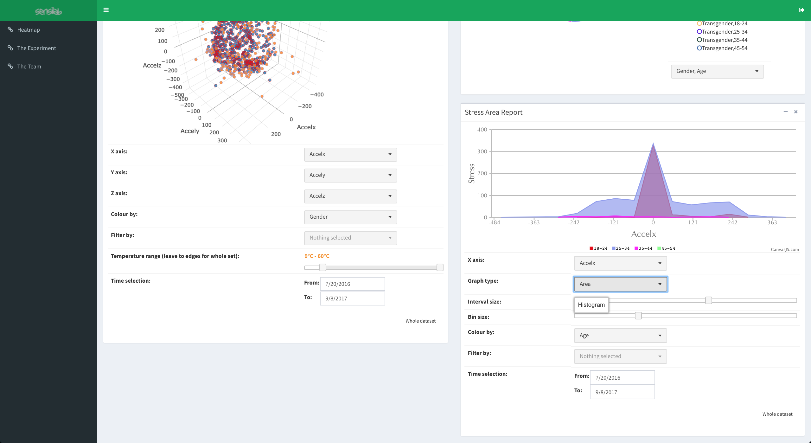
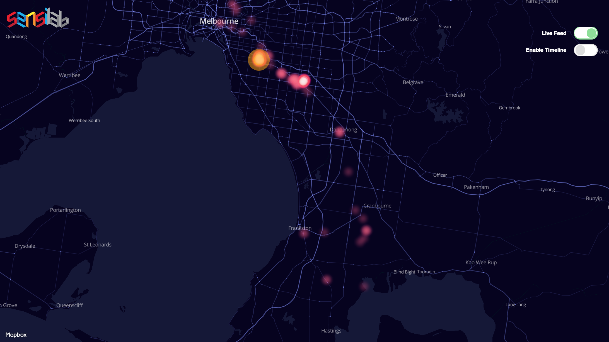

# Summary
The Stress Pendant project was a real-time social experiment that utilised wearable technology and mobile
phones to capture various measurable data that helped identify when people were stressed at any place or
any time.

Participants of the experiment simply squeezed the stress pendant whenever they felt stressed. The
pendant then captured time, temperature, accelerometer data and more variables and then sent this data to
a paired mobile phone via Bluetooth. The mobile phone showed personal data about the participant's stress
history and also relayed the captured data to Google’s Firebase server for data collection and analysis.
My task was to produce a web-based app that shows various data visualizations of
stress data collected. Having a variety of different visualizations of the stress data allowed researches to analyse 
stress more effectively.

There were various technological aspects to this project. The task required researchers to focus on
producing the relevant hardware for the stress pendant and assembling the sensors. This also required a
fair amount of programming in C/C++ in order to communicate with the mobile app. Another task required
researchers to create the mobile app on the IOS and Android platforms meaning that one needed
experience in Swift/Objective C and Java respectively. Furthermore, for data visualization, researchers also
needed to work on the web-based app, which required knowledge of Javascript (and various frameworks
such as D3), Firebase API and also basic HTML/CSS. Researchers also needed to focus on the shape and
material used to produce an appealing and simple stress pendant for usability.
Monash researchers were intrigued about the potential of wearable technology and how it allowed
collection of data about an individual's body and mind. The ability to continuously quantify an individual's life can allow people to make better life decisions and identify health risks.

As a research student, I was particularly inclined to develop the data visualization aspect of the project as I
saw Data Science as a booming and emerging field and analyzing real stress data was the best opportunity
to dive into this area.

Here are some images of the final project:

For more information, please see https://sensilab.monash.edu/research/stress-pendant/
Dashboard link (requires Sensilab authorization): http://sensilab.monash.edu/pendant-dashboard
